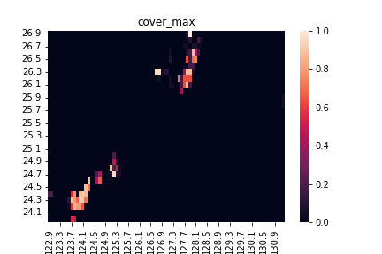
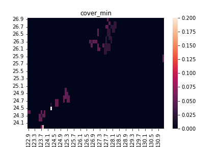
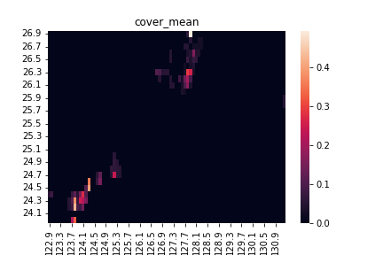
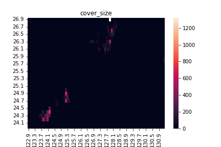
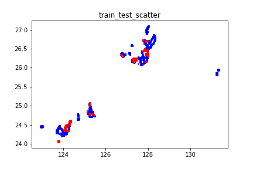
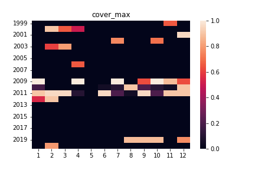
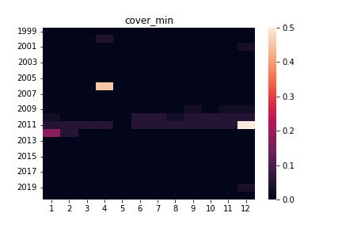
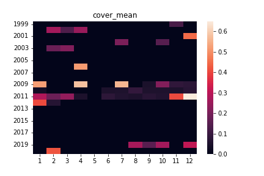
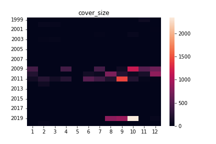
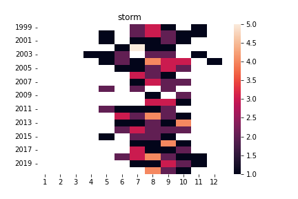

# bluecarbon  portfolio

---

## README.md
>このREADME.mdファイル

## requirements.txt

>$ pip install requirements.txt

>を行うことでバージョンを含めたPython環境を揃えることができる  
>・folium  
>・pandas  
>・matplotlib  
>・numpy  
>・sklearn  
>・functools  
>・math  
>・lightgbm  
>・optuna  
>・torch  
>・tqdm  
>・pickle  
>・joblib  
>・re  

## BlueCarbonダイナミクスを可視化せよ！.pdf
>コンペ成果報告として発表をした際に用いたパワーポイントファイルをpdfに直したもの  

---

## official data
#### YouTube URL
>BlueCarbonダイナミクスを可視化せよ！キックオフ動画のYouTube URL  
>[生物多様性ビックデータに基づいたネイチャーの可視化](https://www.youtube.com/watch?v=tIduAtp2tF8)

>[コンペ課題、テーマについての説明](https://www.youtube.com/watch?v=MslCl9kZv6U)

#### README.md
>公式README.mdファイル

#### feature_description.xlsx
>説明変数の詳細な紹介  
>・被度文献データ  
>・海洋環境要因データ  
>・2019年に撮影された衛星センチネル画像テーブルデータ  
>・同グリッド内で撮影された被度文献データの年月日に最も近い衛星ランドサット画像テーブルデータ  
>・2000からの2020年までの衛星ランドサット画像テーブルデータ  

#### train_data.csv
>訓練データ。  
>14140個のデータ。  

#### test_data.csv
>テストデータ。  
>4039個のデータ。  

#### submit_example.csv
>提出サンプルファイル  

#### image_data.txt
>元衛星画像を格納したGoogle Drive URL  

---

## analyze

#### Ocean_map(not selfmade)
>有志によって作成されたpyファイル。  
>データの緯度経度の分布をPytonのMapモジュールによって可視化したもの  

>[訓練データマップ](analyze/Ocan_map/map_ocean_train.html)  

>[テストデータマップ](analyze/Ocan_map/map_ocean_test.html)  

>このファイルによって、訓練データとテストデータで緯度経度に偏りがあることがわかった。  
>次に緯度経度によって目的変数が変わるのかを検証するためにLatlon_heatmapを実装した。  

#### Latlon_heatmap
>緯度、経度、目的変数をヒートマップとして可視化したもの  

>このファイルによって似た緯度経度では同じ様な目的変数の分布があることがわかった。  
>さらに、年度と目的変数の関係を確認するためにStormを実装した。  

#### Storm
>年、月、台風の接近数、目的変数をヒートマップとして可視化したもの  

>キックオフ動画にて、台風が来た年には大きく目的変数が減少することがあるという説明があった。  
>そこで、気象庁より入手したデータと目的変数の分布を検証した。  
>しかし、検証した所、台風はそこまで影響はないと結論づけた。  
>一方で目的変数と年月の関係は確認できたため、緯度・経度・年を特徴量とした最近傍法の実装に至った。

>okinawa.csvは沖縄地方への接近数のデータ。気象庁より取得  
>[https://www.data.jma.go.jp/fcd/yoho/typhoon/statistics/accession/okinawa.csv](https://www.data.jma.go.jp/fcd/yoho/typhoon/statistics/accession/okinawa.csv)  

#### Train_test_diff

>テストデータと訓練データに偏りがないかを確認するために作成。  
>訓練データテストデータにそれぞれラベルを付与しLGBMに分類タスクをかけた所、スコアは0.9967であった。  
>つまり、訓練データとテストデータ間には偏りが見られた。  
>同階層のmost_gain_importance.csvは分類タスクを課したLGBMの重要度順に整列したものである。  
>LightGBMのゲイン重要度を確認した所海洋環境要因データの川に関係する部分に分類の重要度が高いことがわかった。  
>そこで、川と藻の被度で直接的に関係する部分は塩分濃度であると仮説を立てた。  
>塩分濃度と海藻の相関を散布図により確認したがあまり相関が見えなかった。  
>よって今回のコンペにおいて問題のある偏りではないと結論づけた。  

---

## main
### setup.py
はじめにこのファイルを実行すること。  
minimal_feature_description_for_Landsat_data.csvが生成され、read_info.pyの実行環境が構築される。  

#### main.py
実行用メインファイル  

#### preprocessor
データの前処理  

・Pre_Process_Randsat  
>チームメンバー藤井作成。  
>2000から2020年までのランドサットデータについて補完を行う。  
>補完は年度ごとの線形補間、昨年度の値を取り出す、統計量から補完の優先度で行う。  

・Fillnan_Randsat_Series  
>チームメンバー藤井作成。  
>同グリッド内で撮影された被度文献データの年月日に最も近い衛星ランドサット画像テーブルデータの補完を行う。  
>調査年と同じ年の2000から2020年までのランドサット中央値データで補完を行う。  

・MedianIndexFull  
>チームメンバー西村作成。  
>Fillnan_Randsat_Seriesで補完できなかったデータに対して統計量から補完を行う。  
>統計量＝中央値  

・MeanIndexFull  
>チームメンバー西村作成。  
>Fillnan_Randsat_Seriesで補完できなかったデータに対して統計量から補完を行う。  
>統計量＝平均値  
>中央値で補完を行うよりも平均値で補完を行ったほうがスコアが良かった。  

・StandardScaler  
>(x-x.mean) / x.std  
>平均が0、標準偏差が1となるように変換を行う。  
>NeuralNetworkで用いることを想定。  

・MinMaxScaler  
>(x - x.min) / (x.max - x.min)  
>最大値が0、最小値が1となるように変換を行う。  
>NeuralNetworkで用いることを想定。  

#### predictor
モデルの設計  

・kNearestNeighbor：最近傍法
>距離の近い訓練データ点を出力とするアルゴリズム。  
>入力は緯度、経度、年のみだが、精度向上に大きく貢献した。  

・LightGBMoptuna
>Microsoftによって開発された決定木型学習機  
>米国データサイエンスコンペKaggleでひっぱりだこのモデル  
>ベイズ最適化でハイパーパラメータを調整するモジュールoptunaと組み合わせて使用した。

・RandomForest
>ノンパラメトリックな決定木モデル  
>シード値を変えた複数個で運用するバギングを想定して作成した。  

・NeuralNetwork
>言わずとしれた深層学習  
>今回のタスクがテーブルデータからの回帰であることから全結合層を採用した。  
>値域を割合に抑えることが難しく、時間の都合上アンサンブル学習の対象からは外した。  

#### evaluator
モデルの評価  

・make_score_rmse  
本コンペでの誤差関数。  
二乗誤差平均に平方をとったもの。  

・submit  
提出用ファイルを出力する。  

